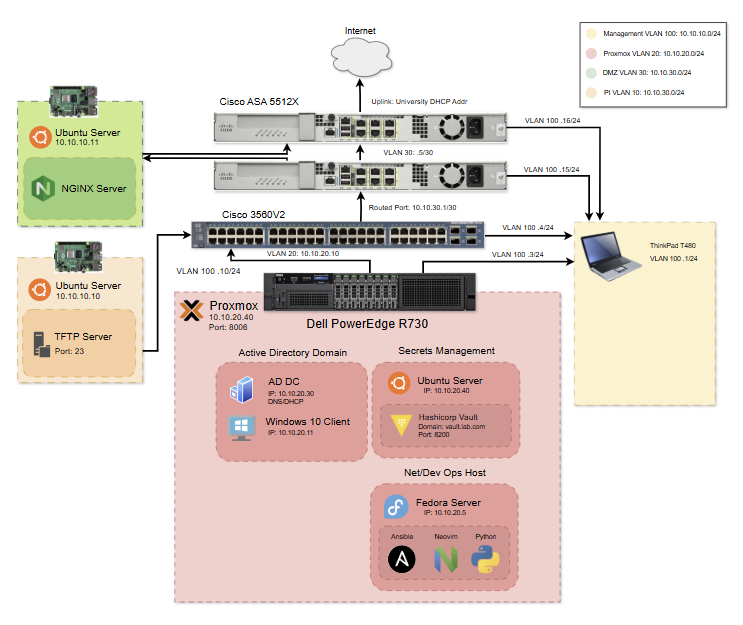

# Portfolio
An ongoing homelab designed to simulate a mid-sized enterprise network for hands-on practice in network security engineering, automation, devops/netops, system administration, and more.
This project demonstrates skills in Cisco networking, Windows AD, and Infrastructure-as-Code using Ansible and Python. Also, systems integration with Proxmox, Windows, and Linux.

# Disclaimer

This is very much a **work in progress**, and I'm in the process of an overhaul. This portfolio is meant to show what I'm working on in my free time, and for personal/showcase use of documentation that I can look at later. I also have an Obsidian vault that holds the bulk of my notes, such as how I integrated Hashicorp Vault line by line and more, in case I need to reference it later.

Implementing:

* **Currently working on:** IPS/IDS with one Raspberry Pi in DMZ
  
* SEIM
  
* User AD environment with identity and access management
  
* Logging
  
* CI/CD pipelines
  
* Secure client-server database application integration
  
* bigger infrastructure with new Cisco REST API capable physical devices
  
* Upgrading the insecure TFTP server to use an NCM platform, such as SolarWinds, connected to a NAS

# Overview

* Network Layer: Cisco L3 switch with VLAN segmentation and Inter-VLAN Routing

* Automation: Ansible playbooks and Python scripts for configuration management and backup

* Security: HashiCorp Vault for secrets management

# Network Design Diagram

# Network Devices

* Main Server: Dell R730
  
* L3 Switch: Cisco 3560V2
  
* Physical Hosts: Raspberry Pi 4's
  
* Firewalls: Cisco ASA 5512X
