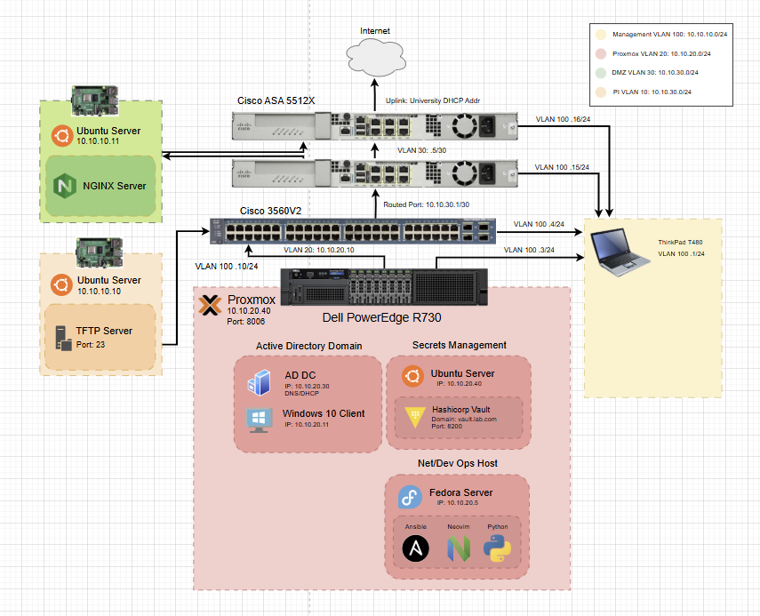

# Portfolio
An ongoing homelab designed to simulate a mid-sized enterprise network for hands-on practice in network security engineering, automation, devops/netops, system administration, and more.
This project demonstrates skills in Cisco networking, Windows AD, and Infrastructure-as-Code using Ansible and Python. Also, systems integration with Proxmox, Windows, and Linux.

# Disclaimer

This is very much a work in progress, and I'm in the process of an overhaul

Plans:
* Implementing a Secure client-server database application
* SEIM
* User AD environment with identity and access managment
* Logging
* CI/CD
* IPS/IDS
* bigger infrastructure
* upgrading TFTP server
* more

# Overview
* Network Layer: Cisco L3 switch with VLAN segmentation and Inter-VLAN Routing

* Automation: Ansible playbooks and Python scripts for configuration management and backup

* Security: HashiCorp Vault for secrets management

# Network Design

# Network Devices

Main Server: Dell R730
L3 Switch: Cisco 3560V2
Physical Hosts: Raspberry Pi 4's
Firewalls: Cisco ASA 5512X
